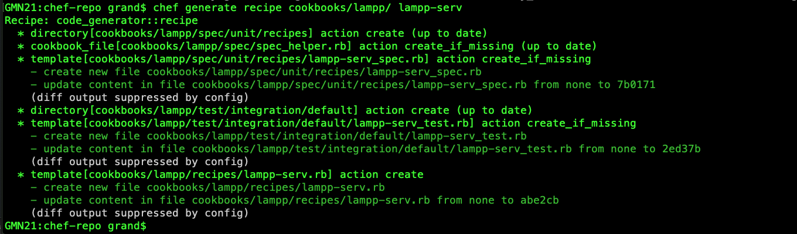

## [Chef workstation, server, and client(node) configration](https://github.com/simulationpoint)

#### [Step 1:](https://github.com/simulationpoint/cheff-ws-server-node/edit/main/README.md)

> Chef workstation (macOS)

*  wget https://packages.chef.io/files/stable/chef-server/12.18.14/ubuntu/18.04/chef-server-core_12.18.14-1_amd64.deb (optional)
* dpkg -i chef-workstation_21.1.233-1_amd64.deb
* brew install chef-workstation(macOS)
* chef generate repo chef-repo
* cd chef-repo
* mkdir .chef
* ssh-keygen -b 4096
* ssh-copy-id ansible@admin.com

`ERROR: ssh: connect to host admin.com port 22: Operation timed out`

`Easy fix ...`

* cat /etc/hosts at the server machine and copy the following to workstation machine

	*  ip chef-serv-name
	
	*  ip chef-work-name
	
	*  ip chef-node-name
* enp0s3: flags=4163<UP,BROADCAST,RUNNING,MULTICAST>  mtu 1500
        inet 198.90.35.2
* ssh user@198.90.35.20
* sudo scp ansible@198.90.35.20:~/.chef/*.pem ~/.chef/

* Create new cookbook - lets cook :D
* chef generate cookbook chef-first-cookbook
* Configure Knife and Bootstrapping a Client Node
* ERROR: Errno::ECONNRESET: Error connecting to https://127.0.0.1/users - Connection reset by 	peer - SSL_connect --> stop apache
   
   
   
   
   
   
* knife ssl fetch

#### [Step 2:](https://github.com/simulationpoint/cheff-ws-server-node/edit/main/README.md)
> Chef server(ubuntu 20.04)

* dpkg -i chef-server-core_*.deb
* chef-server-ctl user-create USER_NAME FIRST_NAME LAST_NAME EMAIL 'PASSWORD' --filename 	~/.chef/USER_NAME.pem
* sudo chef-server-ctl user-create jesh21 Jesh Amera yeshiwas.amera001@umb.edu 'password' --filename ~/.chef/jesh21.pem
* if you got error connecting the server `stop apache`

#### [Step 3:](https://github.com/simulationpoint/cheff-ws-server-node/edit/main/README.md)
> Chef client(node)

#### [Wallah! you have successfully configured cheff CM tool!](https://github.com/simulationpoint)
