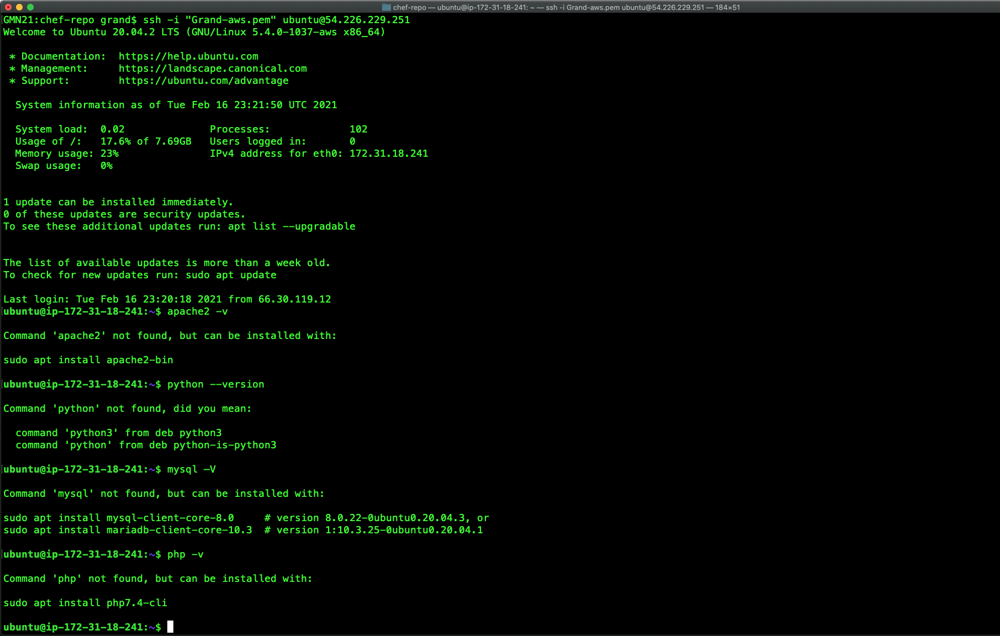

## [Chef workstation, server, and client(node) configration](https://github.com/simulationpoint)

#### [Step 1: Chef workstation ](https://github.com/simulationpoint/cheff-ws-server-node/edit/main/README.md)

1. Screenshot  of apache2 deployment of the basic apache web page(35%)
1. Screenshot  of another cookbook recipe that installs python 3 and runs python3 --version  (35%)
1. Screenshot of running virtual machines in Virtual box or view from AWS console(10%)
1. Screenshot of chef-server-ctl status command showing all running components on your Infra Server(10%)
1. Screenshot of knife ssl check command output(10%)

[Vagrant crash course link](https://www.youtube.com/watch?v=vBreXjkizgo)

	Install the ChefDK
	
	Install the latest version version of the Chef Development Kit for your Operating System from:
	
	https://downloads.chef.io/chef-dk/
	
	Install Git from:
	
	https://git-scm.com/downloads/
	
	Install a Text Editor, like SublimeText, Atom, or Visual Studio Code:
	
	https://www.sublimetext.com/
	
	https://atom.io/
	
	https://code.visualstudio.com
	
	Commands List:
	
	chef --version
	chef-client --version
	knife --version
	ohai --version
	berks --version
	kitchen --version
	foodcritic --version
	cookstyle --version
	
	
	VBoxManage --version
	vagrant --version

>> ___

	vagrant box add bento/centos-7.2 --provider=virtualbox
	vagrant box add bento/ubuntu-18.04 --provider=virtualbox
	vagrant box add bento/ubuntu-20.04 --provider=virtualbox
	
	vagrant init bento/ubuntu-20.04
	vagrant up
	vagrant destroy -> deletes the vm
	
	To chnage the hostname in Debian/ubuntu
		sudo vim /etc/hostname
		sudo vim /etc/hosts
	

Chef workstation 

* wget https://packages.chef.io/files/stable/chef-workstation/21.1.233/ubuntu/20.04/chef-workstation_21.1.233-1_amd64.deb
* dpkg -i chef-workstation_21.1.233-1_amd64.deb
* chef -v

			To uninstall chef-workstation in mac:
			sudo rm -rf /opt/chef-workstation

* touch config.rb
* vim config.rb
* sudo chef-client --local-mode config.rb
* sudo apt-get install -y ruby-full
* ruby -v
* echo 'eval "$(chef shell-init bash)"' >> ~/.bash_profile
 * echo 'eval "$(chef shell-init zsh)"' >> ~/.zshrc  ...... (mac zsh interactive shell)
* echo 'export PATH="/opt/chef-workstation/embedded/bin:$PATH"' >> ~/.configuration_file && source ~/.configuration_file
* echo 'export PATH="/opt/chef-workstation/embedded/bin:$PATH"' >> ~/.bash_profile && source ~/.bash_profile
* sudo apt install -y git-all
* git --version
* chef generate repo chef-repo
* cd chef-repo/cookbooks
* chef generate cookbook apache
* sudo apt-get install -y tree 
* brew install tree (mac)
* chef generate cookbook cookbooks/apache
* chef generate recipe chef-repo/cookbooks/apache/ server

		sudo chef-client --local-mode chef-repo/cookbooks/apache/recipes/server.rb
*  curl localhost .... chef-client in local mode
	* sudo chef-client --local-mode --runlist "recipe[apache::server]"
	* sudo chef-client --local-mode -zr "recipe[apache::server]"
	
> Ruby syntax check
> 
> > ruby -c fileName.rb
> 
> The syntax is valid/invalid

* sudo apt update
* sudo apt install dmidecode

										ohai => server automation(managment)
										ohai + chef-client = magic happen

		file '/var/www/html/index.html' do
		  content "<h1>Hello, world!</h1>
		  ipaddress: #{node['ipaddress']}
		  hostname: #{node['hostname']}
		  "
		end
	
	sudo chef-client -zr "recipe[apache]"

* curl localhost

* https://manage.chef.io/login --- create account and download the chef starter kit

* knife client list
* vagrant ssh-config
* scp -r -P 2222 vagrant@127.0.0.1:/home/vagrant/chef-repo/cookbooks/apache .
* password : vagrant
* knife cookbook upload apache

* knife cookbook list

		   for macOs
		curl "https://awscli.amazonaws.com/AWSCLIV2.pkg" -o "AWSCLIV2.pkg"
		sudo installer -pkg AWSCLIV2.pkg -target /
	
		aws --version
		
		* sudo vim /etc/ssh/sshd_config - uncomment and set "PasswordAuthentication yes"
		* ssh -i your-key.pem username@(public-ip-address)
		* sudo passwd userName
		* sudo service sshd restart
		* ssh userNmae@ec2-public-ip

* But as good practice use `key based authentication`

> ### [Time to bootstrapping the node/s both on local macine(VM) + Cloud(AWS-EC2)]()

	 When using user credentials to bootstrap, the command is as follows:
	
> knife bootstrap FQDN -x USERNAME -P PASSWORD --sudo -N NODE_NAME -r RUN_LIST
	
	 When using key based authentication, the format is:
	
> knife bootstrap FQDN -x USERNAME -i /PATH/TO/IDENTITY_FILE --sudo -N NODE_NAME -r RUN_LIST

> knife bootstrap 54.226.229.251 -U ubuntu -i Grand-aws.pem --sudo -N LAMPP -r "recipe[apache]"
	
	ssh -i "Grand-aws.pem" ubuntu@ec2-54-226-229-251.compute-1.amazonaws.com
	ssh -i "Grand-aws.pem" ubuntu@54.226.229.251
	
	knife bootstrap ec2-54-160-171-106.compute-1.amazonaws.com -N cheftest --ssh-user ubuntu --sudo --i ./.chef/ubuntu-7cff793ad2fb518fd916.pem --sudo
    
    or
    
   knife bootstrap 54.226.229.251 -N chef-SBA --ssh-user ubuntu --sudo --i ./.chef/Grand-aws.pem --sudo 
 
> ### [Before bootstrapping - AWS(EC2)]()

    

### [LAMPP Stack manual]()

	sudo apt update
	sudo apt-get install apache2
	sudo ufw allow 'Apache Full'
	sudo apt-get install mysql-server
	sudo apt-get install php libapache2-mod-php php-mcrypt php-mysql

> ### [After bootstrapping - AWS(EC2), LAMPP stack configured]()

knife bootstrap --help/option  

> knife bootstrap 54.226.229.251 -U ubuntu -i Grand-aws.pem --sudo -N LAMPP -r "recipe[apache]"
> knife node list

	* LAMPP
	* chef-SBA

> knife data bag create passwords
> knife data bag from file passwords data_bags/passwords/mysql.json 
> knife data bag list
> knife data bag show passwords
> knife data bag show passwords mysql

*  wget https://packages.chef.io/files/stable/chef-server/4.13.3-1/ubuntu/18.04/chef-server-core_12.18.14-1_amd64.deb (optional)
* brew install chef-workstation(macOS)
* chef generate repo chef-repo
* cd chef-repo
* mkdir .chef
* ssh-keygen -b 4096
* ssh-copy-id ansible@admin.com

`ERROR: ssh: connect to host admin port 22: Operation timed out`

`Easy fix ...`

* cat /etc/hosts at the server machine and copy the following to workstation machine

	*  ip chef-serv-name
	
	*  ip chef-work-name
	
	*  ip chef-node-name
* enp0s3: flags=4163<UP,BROADCAST,RUNNING,MULTICAST>  mtu 1500
        inet 198.90.35.2
* ssh user@198.90.35.20
* sudo scp ansible@198.90.35.20:~/.chef/*.pem ~/.chef/
* Create new cookbook 
* chef generate cookbook chef-first-cookbook
* Configure Knife and Bootstrapping a Client Node
* ERROR: Errno::ECONNRESET: Error connecting to https://127.0.0.1/users - Connection reset by 	peer - SSL_connect --> stop apache
   
* knife ssl fetch

#### [Step 2:Chef server(ubuntu 20.04)](https://github.com/simulationpoint/cheff-ws-server-node/edit/main/README.md)

* dpkg -i chef-server-core_*.deb
* chef-server-ctl user-create USER_NAME FIRST_NAME LAST_NAME EMAIL 'PASSWORD' --filename ~/.chef/USER_NAME.pem
* sudo chef-server-ctl user-create jesh21 Jesh Amera yeshivas.amera001@umb.edu 'password' --filename ~/.chef/jesh21.pem
* Got Error `stop apache`

#### [Step 3: Chef client(node)](https://github.com/simulationpoint/cheff-ws-server-node/edit/main/README.md)
* Three che-node up and running
	* chef-node1
	* chef-node1
	* chef-node1

#### [Wallah! you have successfully configured cheff CM tool to run LAMPP stack!](https://github.com/simulationpoint)
